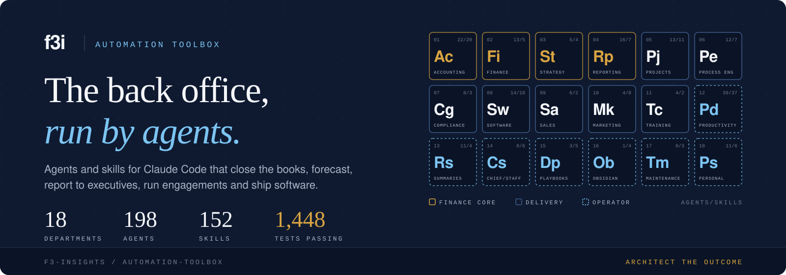
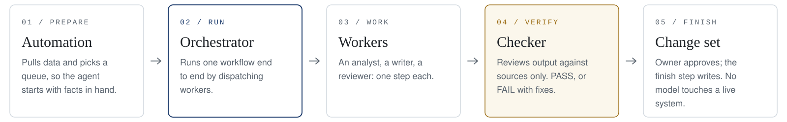

<p align="center">
  
</p>

<p align="center">
  <a href="docs/security/skillspector.md"></a>
  <a href="#install"></a>
  
  
  
  
  
  <a href="LICENSE"></a>
</p>

<p align="center">
  <a href="#what-you-get"><b>What you get</b></a> ·
  <a href="#quick-start"><b>Quick start</b></a> ·
  <a href="#departments"><b>Departments</b></a> ·
  <a href="#how-the-pieces-fit"><b>How it works</b></a> ·
  <a href="docs/getting-started.md"><b>Getting started</b></a> ·
  <a href="#security-scanned-with-nvidia-skillspector"><b>Security</b></a> ·
  <a href="#license"><b>License</b></a>
</p>

<p align="center">
  Agents and skills for Claude Code that run the recurring work of a finance and operations practice:<br>
  closing the books, forecasting, reporting to executives, running client engagements, mapping processes,<br>
  and shipping software. Built and used by <a href="https://f3insights.com"><b>F3 Insights</b></a>.
</p>

---

## What you get

Most agent collections give you prompts. This one gives you **the back office as a working system**: each recurring job a finance and operations team does, written down as a workflow an agent can run, reviewed by a second agent, and finished by plain code you can read.

<table>
<tr>
<td width="33%" valign="top">

### 67 ready workflows

A month-end close, a 13-week cash forecast, a board package, a client update, a process map, an issue-to-pull-request factory, a nightly email sweep. Each one is an **orchestrator** that runs the job end to end the way a lead runs a small team.

</td>
<td width="33%" valign="top">

### Checked before you see it

65 of the 67 workflows end in an independent **checker** or reviewer that reads the output against its sources only and returns PASS or FAIL with fixes. Figures trace to a ledger pull or a file, not to a model's memory.

</td>
<td width="33%" valign="top">

### Nothing writes behind your back

Agents never touch a live system. They leave a **change set** of proposed writes; you approve it, and a plain Python script applies it after the session.

</td>
</tr>
<tr>
<td valign="top">

### Real code, tested

The commands are **222 plain Python scripts** that live inside the skills that use them, with **1,448 tests** on invented data. Nothing to install on your PATH, no framework.

</td>
<td valign="top">

### Yours, not ours

Nothing owner-specific is written into the files. Your folders, thresholds, voice and clients live in **your settings and rules files**, so one orchestrator serves many companies.

</td>
<td valign="top">

### A pattern you can extend

Every agent follows **one template**, and [templates/](templates/) gives you fill-in starting points. A pre-commit check keeps names unique, frontmatter valid and secrets out.

</td>
</tr>
</table>

### Who it is for

- **Fractional CFOs, controllers and finance consultants** who close several companies' books, forecast and report every month.
- **Operations and process consultants** who run discovery, map processes and scope automation for clients.
- **Small-firm owners** who want their week (mail, meetings, tasks, decisions) handled by agents they can audit.
- **Engineers building agent systems** for back-office work, who want a worked example of orchestrators, checkers and change sets at scale.

### A month with the toolbox

| When | Workflow | What you get back |
|---|---|---|
| Every night | `nightly-sweep-orchestrator` | The day's email turned into tasks and notes, and a Daily Note with what needs you |
| Every weekday | `daily-plan-orchestrator` | The morning's three priorities and an evening close |
| Every week | `cash-forecast-orchestrator` | The 13-week cash forecast rolled forward, with the low point called out |
| Every week | `client-delivery-orchestrator` | One engagement's plan, risks and status, ready for the sponsor |
| Every week | `weekly-report-orchestrator` | The leadership weekly, drafted from the week's record |
| Month end | `month-end-orchestrator` | The close worked like a close team: reconciliations, accruals, flux, a review trail |
| Month end | `board-package-orchestrator` | The board package drafted from the finished close, tied out and red-teamed |
| Monthly | `goal-alignment-orchestrator` | Goals set against projects and where the time went, as one approval list |
| On demand | `software-factory-orchestrator` | Issues turned into reviewed, verified pull requests |

## Quick start

Install with one command (needs [Node.js](https://nodejs.org) 18 or later; nothing is published to or downloaded from the npm registry, npx fetches this repository from GitHub):

```bash
npx github:F3-Insights/automation-toolbox list                 # see the departments
npx github:F3-Insights/automation-toolbox install marketing    # install one, with the skills it needs
```

Restart Claude Code, open a session anywhere and ask:

> Use the unslop-email skill on this draft: *paste an email you were about to send*

> Use the unslop-technical skill on this README: *paste a README or design doc*

The [getting-started guide](docs/getting-started.md) walks from there to your first full workflow, with the settings each one needs.

## Departments

Each folder at the root is a department. Open its README for what is inside and what each piece needs to run. The departments fall into three groups, the same three the banner's tiles show.

### Finance core

*4 departments · 56 agents · 36 skills.* The close, the forecast and the numbers leadership reads.

| Department | What it covers | Agents / skills |
|---|---|:---:|
| [Accounting](accounting/) | Month-end close, reconciliations, journal entries, accruals, collections, intercompany, cost accounting, audit support, 1099s | 22 / 20 |
| [Finance](finance/) | Forecasts, budgets, 13-week cash, one-off analysis, investor obligations | 13 / 5 |
| [Strategy](strategy/) | Goals checked against projects and where the time went, and pre-mortems on strategic plans | 5 / 4 |
| [Executive Reporting](reporting/) | Board packages, leadership weeklies, results memos, client updates, and the reviewers every report passes | 16 / 7 |

<details>
<summary><b>Orchestrators in the finance core</b> (18)</summary>

- **Accounting**
  - `month-end-orchestrator`: runs a company's month-end close the way a controller runs a close team
  - `accounting-questions-orchestrator`: answers routine accounting questions between closes and keeps coding consistent
  - `audit-support-orchestrator`: works the auditor's request list (PBC) like a close checklist
  - `collections-orchestrator`: runs order-to-cash between closes, before each AR and collections review
  - `firm-billing-orchestrator`: runs a small professional-services firm's monthly client billing
  - `firm-books-orchestrator`: closes a small firm's own books each month on the month-end pattern
  - `intercompany-orchestrator`: reconciles intercompany balances to zero before consolidation
  - `product-costing-orchestrator`: runs a manufacturer's monthly product-costing review
  - `vendor-1099-orchestrator`: gets vendor 1099s right before year end, not in January
- **Finance**
  - `forecast-orchestrator`: bridges each forecast revision to the one before and builds the rolling vintage
  - `cash-forecast-orchestrator`: rolls the 13-week cash forecast forward each week by the direct method
  - `budget-orchestrator`: builds the annual three-way budget (P&L, balance sheet, cash) from drivers
  - `analysis-orchestrator`: drafts a one-off analysis, scenario model or what-if
  - `investor-posting-orchestrator`: keeps contractual investor data-room postings on time
- **Strategy**
  - `goal-alignment-orchestrator`: prepares the monthly check of goals against projects and time spent
- **Reporting**
  - `board-package-orchestrator`: drafts one company's monthly board package from its finished close
  - `weekly-report-orchestrator`: prepares the weekly report to the leadership team
  - `client-update-orchestrator`: drafts one engagement's weekly client update, as a deck or a memo

</details>

### Delivery

*7 departments · 61 agents · 51 skills.* Client engagements, from the first lead to the last invoice, and the software behind them.

| Department | What it covers | Agents / skills |
|---|---|:---:|
| [Project Management](projects/) | Engagement kickoff and closeout, delivery planning, risk logs, portfolio reviews, pre-mortems | 13 / 11 |
| [Process Engineering](process-engineering/) | Assessments, interview synthesis, process maps, workshops, automation scoping, surveys | 12 / 7 |
| [Compliance & Governance](compliance/) | Filing calendars, IT and AI governance evidence, entity wind-downs | 8 / 3 |
| [Software Development](software/) | Issue-to-pull-request factory, review, verification, releases, and how to build orchestrators | 14 / 18 |
| [Sales & Business Development](sales/) | Pipeline reviews, lead intake, proposals and statements of work, contract audits | 6 / 2 |
| [Marketing & Writing](marketing/) | Content and case studies, brand, and the unslop editing skills | 4 / 8 |
| [Training & Community](learning/) | Seminar and workshop decks, peer learning groups | 4 / 2 |

<details>
<summary><b>Orchestrators in delivery</b> (25)</summary>

- **Projects**
  - `project-engagement-kickoff-orchestrator`: sets up a newly signed engagement as drafts to adopt
  - `client-delivery-orchestrator`: project-manages one engagement like a delivery lead, twice a week
  - `project-health-orchestrator`: the weekly project-health pass over active projects
  - `tech-portfolio-orchestrator`: prepares a client's technology portfolio status before its steering meeting
  - `project-engagement-closeout-orchestrator`: closes a finished engagement with acceptance evidence and a final invoice check
- **Process Engineering**
  - `assessment-intake-orchestrator`: turns a pre-engagement assessment into an anonymized summary
  - `discovery-synthesis-orchestrator`: turns discovery interviews and documents into a read-out and feedback by topic
  - `process-flow-orchestrator`: maps one process as-is and to-be from transcripts and documents
  - `workshop-orchestrator`: prepares a discovery or design workshop, then summarizes it
  - `automation-scoping-orchestrator`: turns a to-be map into a ranked automation backlog with a business case per item
  - `survey-analytics-orchestrator`: runs a client survey season as a checklist
- **Compliance**
  - `compliance-calendar-orchestrator`: keeps the compliance calendar honest, weekly
  - `it-governance-orchestrator`: runs IT and AI governance as a control checklist
  - `wind-down-orchestrator`: drives one legal entity's wind-down to dissolution
- **Software**
  - `software-factory-orchestrator`: runs the issue-to-pull-request factory for one repository, like a lead engineer
  - `issue-harvest-orchestrator`: turns notes, mail, tasks and meeting commitments about the software into filed issues
  - `software-portfolio-review-orchestrator`: the weekly review of every repository carried
  - `software-release-orchestrator`: prepares one repository's next release for the person who ships it
- **Sales**
  - `bd-lead-intake-orchestrator`: answers one inbound lead the day it arrives
  - `bd-pipeline-orchestrator`: runs the weekly pipeline pass
  - `bd-proposal-orchestrator`: drafts a proposal or SOW and audits its contract documents
- **Marketing**
  - `marketing-content-orchestrator`: runs the editorial pipeline
  - `marketing-case-study-orchestrator`: finishes one case study from a closed engagement
- **Training**
  - `learning-seminar-orchestrator`: builds or revises one seminar, workshop or lab deck end to end
  - `learning-community-orchestrator`: runs one session of a peer learning group

</details>

### Operator

*7 departments · 81 agents · 65 skills.* The owner's own week: mail, meetings, tasks, decisions, notes, and the toolbox itself.

| Department | What it covers | Agents / skills |
|---|---|:---:|
| [Personal Productivity](productivity/) | Email, meetings, tasks, calendar, CRM upkeep, weekly planning | 39 / 37 |
| [Recurring Summaries](recurring-summaries/) | The nightly sweep and the daily plan: the night's Daily Note, the morning's three, the evening close | 11 / 4 |
| [Chief of Staff](chief-of-staff/) | Routes requests to the right piece and runs an unattended daily cycle over the owner's agents, with start-of-day, quick capture, status and work-survey tools | 8 / 6 |
| [Decision Playbooks](decision-playbooks/) | Writes down how the owner decides: decisions mined from sent mail and recordings into cited cases, distilled into playbooks the owner ratifies | 3 / 5 |
| [Obsidian](obsidian/) | Video notes into the vault inbox, a vault gardener that only proposes, and an outside-creator scout | 1 / 4 |
| [Toolbox Maintenance](toolbox-maintenance/) | A weekly audit of this toolbox with lint fixes on a review branch, an automation activity audit, and a monthly skill harvest from past sessions | 8 / 3 |
| [Personal](personal/) | Household, health check-ins, home infrastructure, personal finance review, tax season | 11 / 6 |

<details>
<summary><b>Orchestrators for the operator</b> (24)</summary>

- **Productivity**
  - `email-reply-orchestrator`: replies to one person's email in the owner's voice
  - `comms-follow-up-orchestrator`: chases what the owner is owed and closes what they owe
  - `comms-clerical-routing-orchestrator`: routes clerical mail (scheduling, files, intros) to the right place
  - `meeting-prep-orchestrator`: prepares one day's external meetings
  - `meeting-transcript-orchestrator`: processes stored meeting transcripts, oldest first
  - `calendar-steward-orchestrator`: stewards the next two weeks of calendar each weekday
  - `task-capture-orchestrator`, `task-clarify-orchestrator`, `task-reconcile-orchestrator`: capture, clarify and reconcile the task stack
  - `weekly-review-orchestrator`: prepares the GTD weekly review for a 30-minute approval
  - `crm-data-hygiene-orchestrator`, `crm-relationship-tending-orchestrator`: keep the CRM clean and relationships warm
  - `time-study-orchestrator`: measures where a month's time went
- **Recurring Summaries**
  - `nightly-sweep-orchestrator`: sweeps each finished day into tasks, notes and a Daily Note
  - `daily-plan-orchestrator`: plans and closes the workday, twice a weekday
- **Chief of Staff**
  - `chief-of-staff-cycle-orchestrator`: runs one unattended chief-of-staff cycle
- **Decision Playbooks**
  - `playbook-orchestrator`: keeps the playbook pipeline moving, weekly
- **Toolbox Maintenance**
  - `toolbox-audit-orchestrator`: the weekly audit of the toolbox itself
  - `skill-harvest-orchestrator`: the monthly harvest of new skills from past sessions
- **Personal**
  - `household-orchestrator`, `health-routine-orchestrator`, `home-infrastructure-orchestrator`, `personal-finance-review-orchestrator`, `personal-tax-season-orchestrator`

</details>

New agents and skills start from [templates/](templates/): fill-in templates for an orchestrator agent, a sub-agent and a skill, with a small worked example.

## How the pieces fit

<picture>
  <source media="(prefers-color-scheme: dark)" srcset="assets/pipeline-dark.svg">
  
</picture>

- An **agent** is one Markdown file in a department's `agents/` folder. Orchestrators (names ending in `-orchestrator`) run a whole workflow by dispatching worker agents.
- A **skill** is a folder in a department's `skills/` folder: the method for one piece of work, with anything only it uses, including its scripts and tests.
- An **automation** is how a workflow is started on a schedule: a **prepare** step pulls data before the session, and a **finish** step applies the approved change set after it.
- Pieces refer to each other by name, across departments. Names are unique repository-wide.

The full vocabulary (Run, Automation, Context, rules file, change set, owner settings) is in [CONTEXT.md](CONTEXT.md).

## Install

There are two ways in. **npx** copies the departments or skills you choose into Claude Code, which suits most people. **Clone and link** keeps a git clone as the live source, which suits anyone changing the toolbox or wanting every update the moment they pull.

### With npx (recommended)

You need [Node.js](https://nodejs.org) 18 or later and Python 3.11 or later. The installer is one dependency-free script in [bin/](bin/automation-toolbox.mjs); npx fetches it with this repository straight from GitHub.

```bash
npx github:F3-Insights/automation-toolbox list                       # departments, with agent and skill counts
npx github:F3-Insights/automation-toolbox list finance               # what one department holds
npx github:F3-Insights/automation-toolbox install finance strategy   # whole departments
npx github:F3-Insights/automation-toolbox install --skill pre-mortem # one skill
npx github:F3-Insights/automation-toolbox install --all              # everything
```

| Command or option | What it does |
|---|---|
| `install <department>...` | Copies the department's skills to `~/.claude/skills/<skill>/` and its agents to `~/.claude/agents/<department>/`, plus every skill they depend on |
| `install --skill <name>` | One skill and the skills it depends on; repeat the option for more |
| `--project` | Installs into `./.claude` so the pieces belong to one project, not your whole machine |
| `--target <dir>` | Installs somewhere else, for another runtime |
| `--no-agents` | Skills only |
| `--dry-run` | Shows what would change and changes nothing |
| `status` | Lists what the installer has put in place |
| `uninstall` | Removes exactly what the installer put in place, nothing else |

**Updating.** Run the same `install` command again: npx fetches the latest commit and the installer replaces what it installed before. To stay on one version, pin it: `npx github:F3-Insights/automation-toolbox#<commit>`.

**Safe by default.** The installer never overwrites a skill or agent it did not install: one of yours with the same name is skipped and reported (`--force` replaces it). It records what it installed in `~/.claude/.f3i-toolbox.json`, so `uninstall` removes only those. Test folders are left out.

**After installing.** Restart Claude Code. Some scripts need Python packages: `pip install pyyaml openpyxl python-pptx pypdf pillow`. Skills that need settings say so the first time they run; [docs/settings.md](docs/settings.md) lists every one.

### Clone and link (for contributors)

The toolbox is kept in department folders so people can find things. Claude Code and other runtimes need one flat list instead: every skill at `skills/<name>/` and every agent under `agents/`. So the clone is the source you edit, and a link script installs a flat view of it, made only of links back into the clone. Nothing is copied: edit a file in the clone and the change is live at once.

| | Source (for people) | Install (for runtimes) |
|---|---|---|
| Where | this clone | `~/.local/share/f3i-toolbox` (or `F3I_TOOLBOX_LINK_DIR`) |
| Shape | `<department>/agents/`, `<department>/skills/` | `agents/<department>/<name>.md`, `skills/<name>/` |
| Read by | you and your team | Claude Code, Codex, or another agent runtime |

1. **Clone** the repository and turn on its git hooks, once:

   ```
   git config core.hooksPath .githooks
   ```

2. **Build the install** once:

   ```
   python3 setup/link.py          # or setup/link.sh
   ```

   It stops, changing nothing, if two pieces share a name. `--check` shows what it would change.

3. **Point your runtime at it.** For Claude Code, link its two folders to the install, keeping your old ones as a dated backup (the script prints these lines; it never runs them):

   ```
   mv ~/.claude/skills ~/.claude/skills.bak-YYYYMMDD
   ln -s ~/.local/share/f3i-toolbox/skills ~/.claude/skills
   mv ~/.claude/agents ~/.claude/agents.bak-YYYYMMDD
   ln -s ~/.local/share/f3i-toolbox/agents ~/.claude/agents
   ```

   Another agent runtime is pointed at the same two folders in its own configuration.

4. **Fill in your settings**: `~/.config/f3i-toolbox/settings.toml`, described in [docs/settings.md](docs/settings.md).

<details>
<summary><b>Keeping it current, and removing it</b></summary>

**Keeping it current.** The hooks from step 1 rerun the link script after every commit, merge, pull and branch switch, so a new, renamed or removed agent or skill shows up in the install without you doing anything. They print one line only when something changed, run only in the main clone (never in a git worktree), do nothing until step 2 has been done once, and never stop a git command. Without the hooks, rerun `python3 setup/link.py` after you pull.

**Why `~/.claude/skills` appears in commands.** Agents and skills run a skill's scripts by a fixed path, `python3 ~/.claude/skills/<skill>/scripts/<script>.py`, and a runtime that reads skills by path uses the same folder. That path must reach the install, which step 3 does. A different setup, such as installing departments as Claude Code plugins, would need those paths to change too.

**Removing it.** Delete the two `~/.claude` links, move your backups back, and delete `~/.local/share/f3i-toolbox`; the clone is untouched.

</details>

## Before you run anything

- **What each piece needs.** Every department README has a "Needs" column: nothing beyond Claude Code, a web search, the Insights Portal MCP server, Sage Intacct, a command, or an owner setting. Start with pieces that need nothing.
- **The Insights Portal.** Many productivity, sales and project pieces read and write through F3 Insights' Portal MCP server. Without it, those pieces stop and say what they need; the finance core works from folders and, for ledger pulls, Sage Intacct.
- **Settings and secrets.** Scripts read owner settings from `~/.config/f3i-toolbox/settings.toml` and secrets from environment variables only. [docs/settings.md](docs/settings.md) lists every key and variable, with an example file.
- **Your facts stay yours.** Voice guides, folders and rules files are inputs you supply; nothing here assumes a particular person or company.
- **Status.** The scripts are tested against invented data and fake servers. See the [roadmap](docs/roadmap.md) for what has not yet been run against live systems.

## Checking a change

```
git config core.hooksPath .githooks       # once per clone
python3 scripts/toolbox_check.py          # what the hook runs
```

The check fails on private names (from lists kept outside the repository), machine details, real email addresses, secret-shaped strings, duplicate names, and broken agent or skill frontmatter.

To run the tests, make a virtual environment with `pytest`, `pyyaml`, `pypdf`, `openpyxl`, `python-docx` and `python-pptx`, then:

```
.venv/bin/python scripts/run_tests.py              # every skill, one pytest process each
.venv/bin/python scripts/run_tests.py accounting   # one department
```

## Security: scanned with NVIDIA SkillSpector

<p>
  <a href="docs/security/skillspector.md"></a>
</p>

Every skill here is scanned with **[NVIDIA SkillSpector](https://github.com/NVIDIA/SkillSpector)**, NVIDIA's open-source security scanner for AI agent skills, and the results are published in full: **[read the scan report](docs/security/skillspector.md)**.

**What it is.** SkillSpector checks a skill's instructions and code against 71 vulnerability patterns in 17 categories (prompt injection, data exfiltration, privilege escalation, supply-chain risk, excessive agency, dangerous code and more) and gives each skill a 0 to 100 risk score. It is part of the [NVIDIA Verified Skills pipeline](https://docs.nvidia.com/skills/) NVIDIA uses before it publishes skills.

**Why it matters.** A skill runs with your permissions: it can read files, run commands and call the network. Skills are shared like software but rarely reviewed like it, and SkillSpector's research found vulnerabilities in 26.1% of public skills it analysed and signs of malicious intent in 5.2%. These skills touch ledgers, mail and client work, so you should see the evidence before you install them.

**What it found.** On the latest scan (static analysis, v2.12.0), 106 of 152 skills rated LOW, 27 MEDIUM, 9 HIGH and 10 CRITICAL. The high ratings come mostly from skills that call authenticated APIs (a token read from the environment and sent to Sage Intacct or the Insights Portal), scripts that run other scripts, and undeclared tool scopes. The [report](docs/security/skillspector.md) lists every high-rated skill and explains each kind of finding, so you can review a skill before you install it.

**Scan anything yourself**, ours or anyone else's, before you install it:

```bash
uv tool install git+https://github.com/NVIDIA/skillspector.git
skillspector scan path/to/skill --no-llm
```

A [GitHub workflow](.github/workflows/skillspector.yml) rescans every skill on each change and once a week.

## Documentation

| Read | For |
|---|---|
| [Getting started](docs/getting-started.md) | From clone to your first skill, then your first full workflow |
| [CONTEXT.md](CONTEXT.md) | The vocabulary: department, agent, orchestrator, skill, Run, Automation, change set |
| [docs/settings.md](docs/settings.md) | Every owner setting and environment variable, with an example file |
| [docs/adr/](docs/adr/) | The design decisions and why they were made |
| [Roadmap](docs/roadmap.md) | What is next, and what has not been proven yet |
| [TOOLBOX-DESIGN-SUGGESTIONS.md](TOOLBOX-DESIGN-SUGGESTIONS.md) | The practices and research behind the next decisions |
| [CONTRIBUTING.md](CONTRIBUTING.md) | How to add or change a piece |
| [SkillSpector scan report](docs/security/skillspector.md) | What NVIDIA SkillSpector found in every skill, and what it means |
| [SECURITY.md](SECURITY.md) | How to report a vulnerability |

## FAQ

<details>
<summary><b>Do I need F3 Insights' Portal?</b></summary>

No. Most of the finance core, process engineering, strategy's pre-mortem and the editing skills work from folders and files, with Sage Intacct for ledger pulls; the software factory works from GitHub. Pieces that read mail, calendar, tasks and the CRM, and the compliance trackers, expect the Insights Portal MCP server; each says so in its department README.

</details>

<details>
<summary><b>Will an agent change my books, inbox or repositories on its own?</b></summary>

No. Agents write drafts and a change set into the Run's folder. A plain script applies the change set after the owner approves it, and only the kinds of change the workflow allows.

</details>

<details>
<summary><b>Which models does it use?</b></summary>

Each agent names a model tier in its frontmatter: a fast model for bulk reading, a strong model for building and reviewing, and the strongest for final sign-off. Substitute your own.

</details>

<details>
<summary><b>Does it work outside Claude Code?</b></summary>

The skills and scripts are plain Markdown and Python, and the install is a folder of links any runtime can read. Orchestrators that dispatch sub-agents are written for Claude Code today; the [roadmap](docs/roadmap.md) covers a Codex compatibility pass.

</details>

<details>
<summary><b>Can my company use it?</b></summary>

Yes, for your own work, under the license below. What the license does not allow is offering a product or service that competes with the toolbox or with what F3 Insights provides using it. For that, ask F3 Insights about a commercial license.

</details>

## Third-party material

Some skills are adapted from other people's published work. [THIRD-PARTY-NOTICES.md](THIRD-PARTY-NOTICES.md) lists each one with its upstream and license, and each adapted skill keeps its original license file.

## License

The toolbox is **source-available** under the [PolyForm Shield License 1.0.0](LICENSE).

| You can | You cannot |
|---|---|
| Use it, for free, inside your own company or practice | Sell it, or a product or service that competes with it or with what F3 Insights provides using it |
| Read, change and adapt it to your own work | Remove the license or the `Required Notice` line when you share it |
| Share copies, with the license and the notice | |

Anyone who gets a copy from you must also get the license terms and this line:

```
Required Notice: Copyright (c) 2026 F3 Insights (https://f3insights.com)
```

Third-party skills stay under their own licenses, listed in [THIRD-PARTY-NOTICES.md](THIRD-PARTY-NOTICES.md). For a commercial license, contact [F3 Insights](https://f3insights.com).

---

<p align="center">
  <sub>Built and used by <a href="https://f3insights.com"><b>F3 Insights</b></a> · Architect the outcome</sub>
</p>
